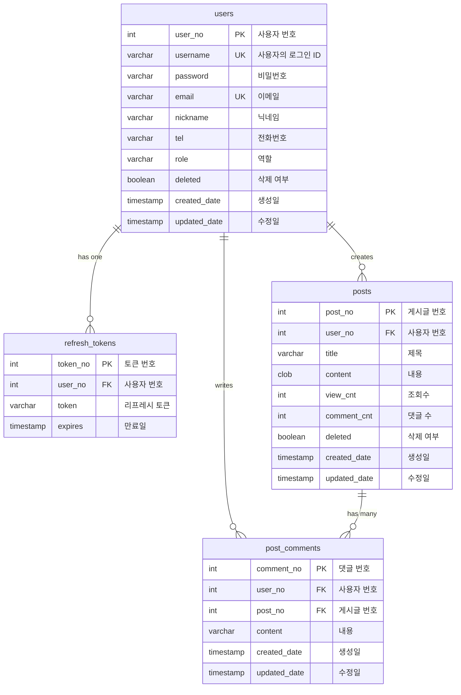

# 테이블 구조
- 웹 애플리케이션에서 사용자 관리, 인증, 게시물 및 댓글 기능을 구현하기 위한 테이블 구조다.
- H2 데이터베이스를 기준으로 작성되었다.

## 구성
### `users` 테이블
- **목적**: 애플리케이션에 가입한 사용자 정보를 저장합니다.
- **주요 컬럼**:
  - `user_no` (Primary Key, `int`, 자동 증가): 각 사용자를 고유하게 식별하는 번호입니다.
  - `username` (`varchar(50)`, Not Null, Unique): 사용자의 로그인 ID로 사용되며, 중복될 수 없습니다.
  - `password` (`varchar(255)`, Not Null): 사용자의 비밀번호를 저장합니다. 보안을 위해 암호화된 형태로 저장되어야 합니다.
  - `email` (`varchar(255)`, Not Null, Unique): 사용자의 이메일 주소로, 중복될 수 없습니다.
  - `nickname` (`varchar(50)`): 사용자가 설정한 별명입니다.
  - `tel` (`varchar(100)`): 사용자의 전화번호입니다.
  - `role` (`varchar(20`), 기본값 'ROLE_USER'): 사용자의 권한(예: `'ROLE_USER'`, `'ROLE_ADMIN'`)을 정의합니다.
  - `deleted` (boolean, 기본값 false): 사용자가 삭제되었는지 여부를 나타내는 플래그입니다. 실제 데이터를 삭제하는 대신 이 플래그를 사용하여 논리적 삭제를 처리할 수 있습니다.
  - `created_date` (`timestamp`, 기본값 `current_timestamp`): 사용자 계정이 생성된 시각입니다.
  - `updated_date` (`timestamp`, 기본값 `current_timestamp`): 사용자 정보가 마지막으로 업데이트된 시각입니다.

### `refresh_tokens` 테이블
- **목적**: 사용자 인증을 위한 리프레시 토큰 정보를 저장합니다. 주로 JWT(JSON Web Token) 기반 인증 시스템에서 사용됩니다.
- **주요 컬럼**:
  - `token_no` (Primary Key, `int`, 자동 증가): 각 리프레시 토큰을 고유하게 식별하는 번호입니다.
  - `user_no` (Foreign Key, `int`, Not Null, Unique): 이 리프레시 토큰이 속한 `users` 테이블의 `user_no`를 참조합니다. Unique 제약 조건이 있어 한 사용자당 하나의 리프레시 토큰만 가질 수 있음을 의미합니다 (1:1 관계).
  - `token` (`varchar(100)`, Not Null): 실제 리프레시 토큰 문자열입니다.
  - `expires` (`timestamp`): 리프레시 토큰의 만료 시각입니다.

### `posts` 테이블
- **목적**: 사용자들이 작성한 게시물 정보를 저장합니다.
- **주요 컬럼**:
  - `post_no` (Primary Key, `int`, 자동 증가): 각 게시물을 고유하게 식별하는 번호입니다.
  - `user_no` (Foreign Key, `int`, Not Null): 이 게시물을 작성한 `users` 테이블의 `user_no`를 참조합니다. (1:N 관계: 한 사용자가 여러 게시물을 작성할 수 있습니다).
  - `title` (`varchar(255)`, Not Null): 게시물의 제목입니다.
  - `content` (`clob`, Not Null): 게시물의 본문 내용입니다. `clob`은 대용량 텍스트 데이터를 저장하는 데 사용됩니다.
  - `view_cnt` (`int`, 기본값 `0`): 게시물의 조회수입니다.
  - `comment_cnt` (`int`, 기본값 `0`): 게시물에 달린 댓글의 수입니다. (이 컬럼은 `post_comments` 테이블의 레코드 수와 일치하도록 애플리케이션 로직에서 관리될 수 있습니다).
  - `deleted` (`boolean`, 기본값 `false`): 게시물이 삭제되었는지 여부를 나타내는 플래그입니다.
  - `created_date` (`timestamp`, 기본값 `current_timestamp`): 게시물이 생성된 시각입니다.
  - `updated_date` (`timestamp`, 기본값 `current_timestamp`): 게시물이 마지막으로 업데이트된 시각입니다.

### `post_comments` 테이블
- **목적**: 게시물에 달린 댓글 정보를 저장합니다.
- **주요 컬럼**:
  - `comment_no` (Primary Key, `int`, 자동 증가): 각 댓글을 고유하게 식별하는 번호입니다.
  - `user_no` (Foreign Key, `int`, Not Null): 이 댓글을 작성한 `users` 테이블의 `user_no`를 참조합니다. (1:N 관계: 한 사용자가 여러 댓글을 작성할 수 있습니다).
  - `post_no` (Foreign Key, `int`, Not Null): 이 댓글이 속한 `posts` 테이블의 `post_no`를 참조합니다. (1:N 관계: 한 게시물에 여러 댓글이 달릴 수 있습니다).
  - `content` (`varchar(1000)`, Not Null): 댓글의 본문 내용입니다.
  - `created_date` (`timestamp`, 기본값 `current_timestamp`): 댓글이 생성된 시각입니다.
  - `updated_date` (`timestamp`, 기본값 `current_timestamp`): 댓글이 마지막으로 업데이트된 시각입니다.
 
## 테이블 간의 관계 요약
- `users` ↔ `refresh_tokens`: 1대1 관계 (한 사용자는 하나의 리프레시 토큰을 가질 수 있습니다).
- `users` ↔ `posts`: 1대다 관계 (한 사용자는 여러 게시물을 작성할 수 있습니다).
- `users` ↔ `post_comments`: 1대다 관계 (한 사용자는 여러 댓글을 작성할 수 있습니다).
- `posts` ↔ `post_comments`: 1대다 관계 (한 게시물은 여러 댓글을 가질 수 있습니다).

## ERD


## DDL 구문
```sql
create table if not exists users (
    user_no int generated always as identity primary key,
    username varchar(50) not null unique,
    password varchar(255) not null,
    email varchar(255) not null unique,
    nickname varchar(50),
    tel varchar(100),
    role varchar(20) default 'ROLE_USER',
    deleted boolean default false,
    created_date timestamp default current_timestamp,
    updated_date timestamp default current_timestamp
);

create table if not exists refresh_tokens (
    token_no int generated always as identity primary key,
    user_no int not null unique references users (user_no),
    token varchar(100) not null,
    expires timestamp
);

create table if not exists posts (
    post_no int generated always as identity primary key,
    user_no int not null references users (user_no),
    title varchar(255) not null,
    content clob not null,
    view_cnt int default 0,
    comment_cnt int default 0,
    deleted boolean default false,
    created_date timestamp default current_timestamp,
    updated_date timestamp default current_timestamp
);

create table if not exists post_comments (
    comment_no int generated always as identity primary key,
    user_no int not null references users (user_no),
    post_no int not null references posts (post_no),
    content varchar(1000) not null,
    created_date timestamp default current_timestamp,
    updated_date timestamp default current_timestamp
);
```
